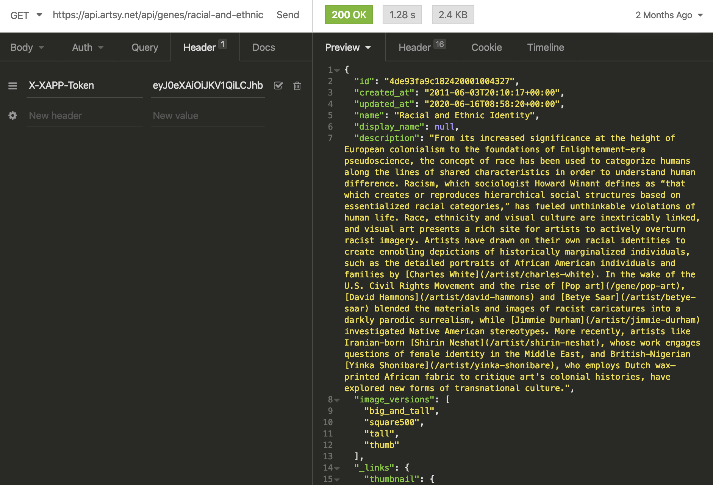
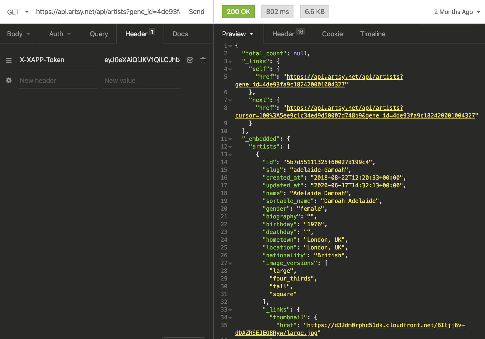
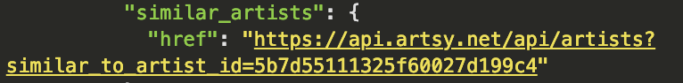
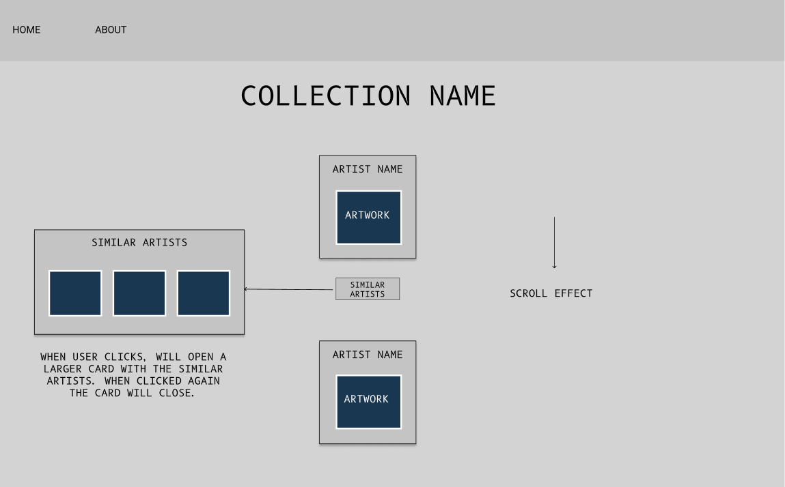
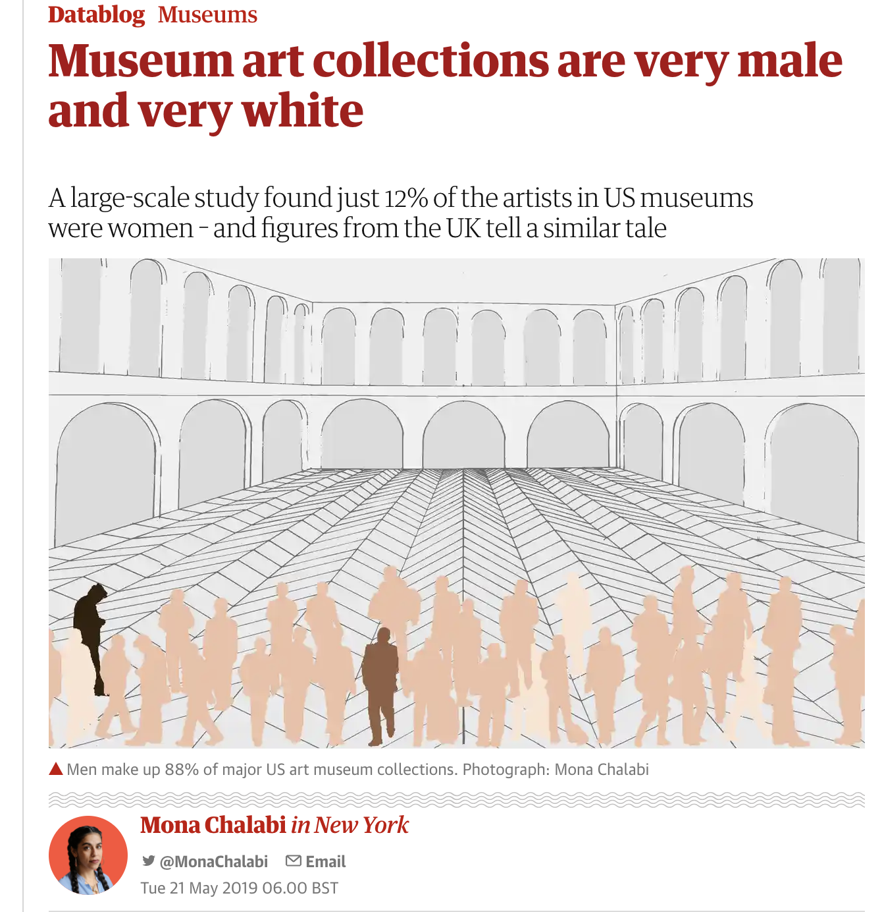
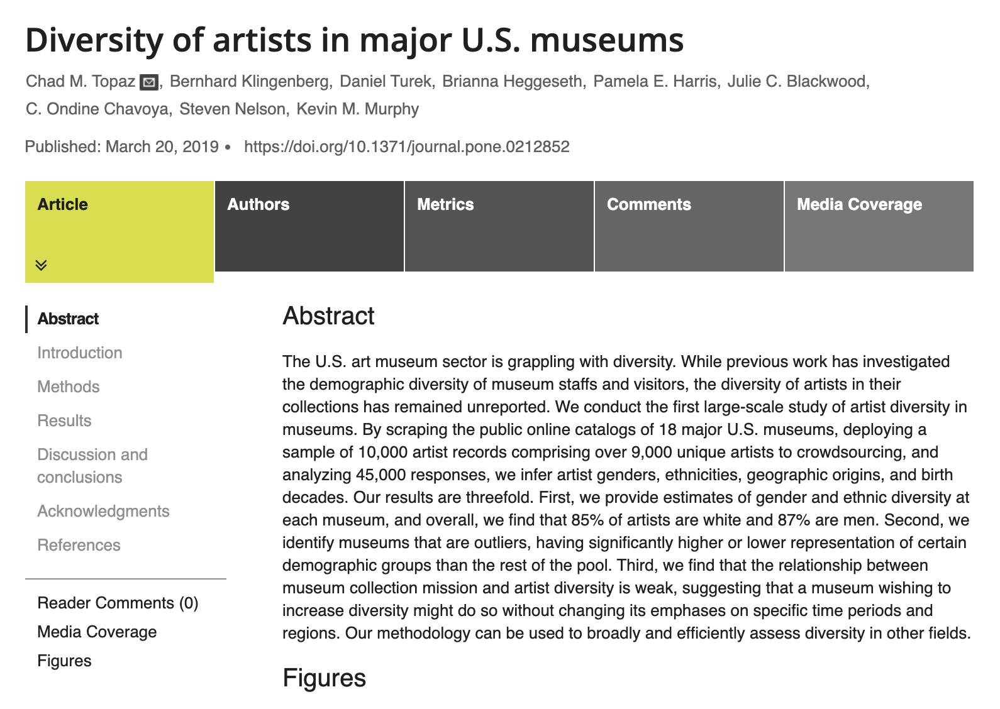
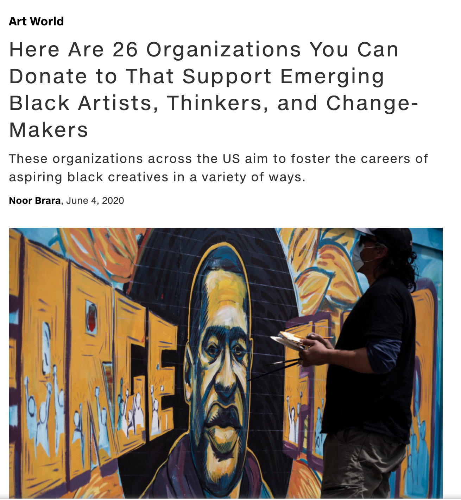

# 
# Project 2 - /TITLED

By [Raquel Cruickshank](https://github.com/cruickshankrpc) and [Kianna Love](https://github.com/akirakianna)

## Overview 
This was my first experience of a Hackathon and boy did I love it. Making split decisions to build under pressure and complete a final product in **48 hours** was a thrill, and I am proud of the final result.\
This was a pair-programmed project and I thoroughly enjoyed bouncing ideas off my partner who has a similar aesthetic sensibility.\
During Project 1, in the wake of the murder of George Floyd, agonising over the logic to make aliens move on a grid felt trivial to say the least.\
So, for this project, Kianna and I decided to address the underrepresentation of Black, Asian and minority ethnic groups by shining a light on POC artists and other works that explore their lived experience.

.gif)


Please visit [here](https://cruickshankrpc.github.io/TITLED/).


## Contents
  - [Overview](#overview)
  - [Contents](#contents)
  - [Brief](#brief)
  - [Technologies Used](#technologies-used)
  - [BUILD](#build)
      - [First Hurdle](#first-hurdle)
      - [Solution](#solution)
  - [Challenges](#challenges)
  - [Wins & Key Learnings](#wins--key-learnings)
  - [Bugs](#bugs)
  - [Future Features](#future-features)

## Brief
Build a React application that: 
- Consumes a public API.
- Has several components.
- Includes a router with several 'pages'
- Includes wireframes - designed before building the app.
- Have semantically clean HTML.
- Be deployed online

## Technologies Used 
- HTML5
- SCSS
- React
- Insomnia
- Artsy API
- Axios
- Scroll Magic
- Bulma 


## BUILD

We settled on the Artsy API due to their huge range of artworks that they not only display, but also sell. 
We attained a Client ID & Secret in order to generate a token and test out different endpoints in Insomnia. 
Kianna cleverly found the Genome Project - Artsy's own thematic curation of artworks. This way, we could retrieve artist information via the gene ID of the project.

**Endpoint for 'Racial & Ethnic Identity' Gene:**


**Endpoint from that Gene ID:**


Our plan was as follows: 
1. Research public APIs
2. Select and test endpoints in Insomnia 
3. Plan MVP
4. Build
5. Style
6. Fix bugs, stretch goals 
7. Refactor code

#### First Hurdle
Alas, disaster struck. The Artsy API proved to be a nightmare to retrieve information from - none of the exhibitions we liked on their website had endpoints and, once we found the 'Genome Project', the endpoint only returned ONE artwork for each of only FIVE artists, which would hardly populate the page with the gallery of artworks we envisioned.

#### Solution
We discovered we could access the nested endpoint 'similar artists' to retrieve another five artists with one artwork each:



Now, we could plan our MVP and wireframe:


We didn't start writing code until DAY 2, and so the pressure was on to build AND style in a short space of time.

This is the function we created to display similar artists:
```javascript
function displaySimilar(event, buttonKey) {
    if (buttonKey === key) {
      setSimilarArtists([])
    
    } else {
      const id = event.target.id
      fetch(event.target.value, { headers: { 'X-XAPP-Token': `${token}` } })
        .then(resp => resp.json())
        .then(data => {
         const newSimilarArtists = data._embedded.artists.map((similarArtist) => {
         return { ...similarArtist, originalArtistID: id }
       })
       const combinedArtists = similarArtists.concat(newSimilarArtists)
       const result = []
       const artistExists = {}
       combinedArtists.forEach((artist) => {
          if (!artistExists.hasOwnProperty(artist.id)) {
             result.push(artist)
             artistExists[artist.id] = true
            }
          })
          setKey(buttonKey)
          setSimilarArtists(result)
        })
    }
  }
```
**How it turned out:**


Once we completed our MVP, I created the 'About' page with added links to resources:








## Challenges
- Retrieving nested information from the API.
- Realising our token expired every 7 days (We wrote a refresh token function post-course).

## Wins & Key Learnings
- Built a full application in 48 hours! Used React Router to navigate between our components. 
```javascript
  const App = () => {

  return <HashRouter>
    <NavBar />
    <Switch>
      <Route exact path="/" component={HomePage} />
      <Route exact path="/about" component={About} />
      <ApiProvider>
        <Route exact path="/randei" component={RandEI} />
        <Route exact path="/migration" component={MigrationArtists} />
        <Route exact path="/sg" component={SouthernGothic} />
      </ApiProvider>
    </Switch>
  </HashRouter>
}

export default App
```
- 💁🏻‍♀️💁🏻‍♀️ Pair-programming. It was really fun to bounce ideas off a partner. We problem solved and dealt with challenges together, but also split off to work on separate components. 
- STYLING: Chuffed with the final design. 
- **React hooks**: developed confidence using **useState** and **useEffect**.
```javascript 
  const [artistsData, setArtistsData] = useState([])
  const [similarArtists, setSimilarArtists] = useState([])
  const token = useContext(ApiContext)
  const [key, setKey] = useState('')

  useEffect(() => {
    fetch('https://api.artsy.net/api/artists?gene_id=5266f899cd530eb849000222', { headers: { 'X-XAPP-Token': token } })
      .then(resp => resp.json())
      .then(data => {
        const newData = data._embedded.artists.map((artist) => {
          return { ...artist, showSimilarArtist: false }
        })
        setArtistsData(newData)
      })
  }, [])
```
- Using React Scroll-Magic. I had a lot of fun using this for the first time. 
- Building a Carousel. 
- Creating the type-writer animation. I developed a love of tinkering with animations on this project. 

## Bugs
- For some reason, the 'Racial and Ethnic Identity' API images do not return on first click, but do if you click on another page and return to it. It also breaks if you refresh page. 
- Type-script animation moves the page in mobile.
- Sometimes the 'similar artists' button is sticky/breaks.

## Future Features 
- Make MOBILE FIRST ! 
- More pages on profiles of artists/ ways to support.


